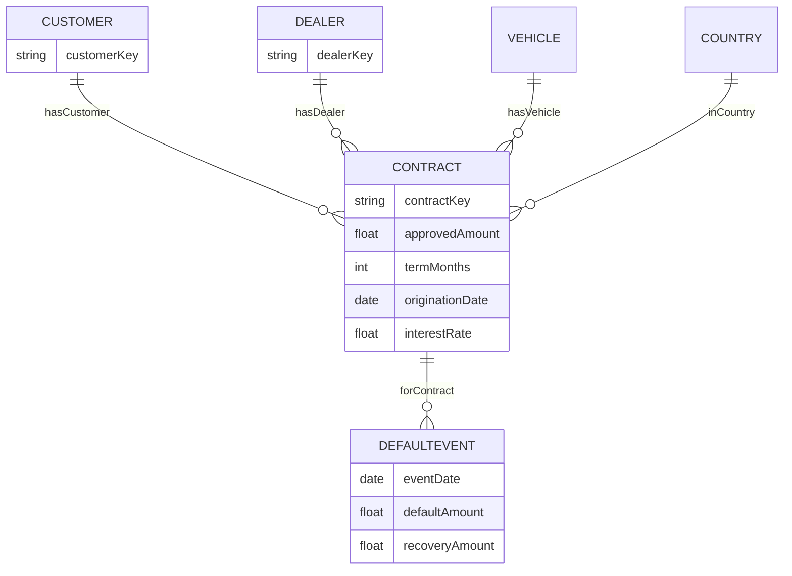

# 2. Conceptual model
This is the **conceptual (business) model**: entities and relationships, independent of storage (DWH/RDF/Neo4j).
---
## 2.0 Business definitions
### What “Default” means
**Default** means the loan/contract is considered **failed to pay** under the institution’s default definition (e.g., severe delinquency such as 90+ days past due and/or “unlikeliness to pay” per policy).  
In this demo, **default is not inferred from raw payments inside the KG**. Instead, it is represented as a curated fact/event coming from **Silver/Gold** (source system or marts).
### What `DefaultEvent` means
A **DefaultEvent** is an **audit/event record** that a specific `Contract` entered default, with:
- `eventDate`: when default was recognized/recorded
- `defaultAmount`: the amount classified as defaulted at that time (per mart definition)
- `recoveryAmount`: recovered amount associated with that default event (if available)
Using an event (instead of only `Contract.status`) preserves **timing and auditability**, and supports future extensions (cure/redefault/restructure).
---
## 2.1 Core entities
- **Customer**: borrower entity (keyed)
- **Contract**: loan/financing contract (keyed)
- **Dealer**: originator/partner entity (keyed)
- **Vehicle**: financed asset (keyed)
- **Country**: geographic entity (keyed)
- **DefaultEvent**: event referencing a contract (keyed or event-id)
## 2.2 Relationships (business meaning)
- Contract **hasCustomer** Customer
- Contract **hasDealer** Dealer (optional in demo, required in some banks)
- Contract **hasVehicle** Vehicle
- Contract **inCountry** Country
- DefaultEvent **forContract** Contract
## 2.3 Diagram (Mermaid)

2.4 Notes
TODO: Decide whether hasDealer is required (minCount=1) or optional (minCount=0) and reflect in SHACL.
TODO: Add Payment/Balance snapshot if needed as event nodes (n-ary facts). please give me full markdown format to downlad it